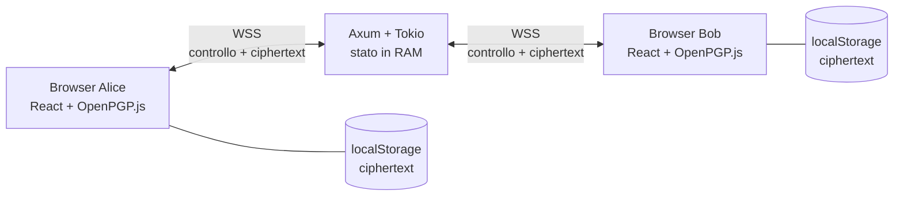

# Secret Chat — specifica V1

Stato: approvata per implementazione  
Ultimo aggiornamento: 19 agosto 2026

## 1. Obiettivo

Secret Chat è una web app di messaggistica testuale end-to-end, privacy-first e senza database.

La V1 deve permettere a due utenti contemporaneamente online di:

1. autenticarsi con nickname e chiavi OpenPGP proprie;
2. importare la chiave pubblica di un contatto ricevuta privatamente fuori dall'app;
3. esprimere reciprocamente la volontà di entrare in contatto;
4. scambiarsi messaggi firmati e cifrati;
5. gestire più chat nella stessa interfaccia;
6. conservare contatti e cronologie cifrate soltanto nel browser.

Il backend instrada payload opachi e mantiene esclusivamente stato volatile in RAM. Non deve mai ricevere la chiave privata, la passphrase o il testo in chiaro.

## 2. Principi della V1

- Nessun database, broker, coda o storage server persistente.
- Nessun account tradizionale, password applicativa, email o numero di telefono.
- Nessuna directory o ricerca degli utenti.
- Le chiavi pubbliche dei contatti vengono scambiate privatamente tramite un canale esterno scelto dagli utenti.
- Il backend non distribuisce le chiavi pubbliche dei contatti.
- Nessun messaggio offline.
- Una sola replica backend in esecuzione.
- Crittografia applicata esclusivamente nel browser.
- Protocollo crittografico OpenPGP tramite librerie esistenti; nessuna primitiva inventata dall'app.
- Dipendenze e componenti limitati a quelli richiesti dalla V1.

## 3. Non-obiettivi

Sono esplicitamente fuori dalla V1:

- gruppi e canali;
- allegati, immagini, audio e file;
- Markdown, HTML e anteprime dei link;
- messaggi offline e retry automatici;
- ricevute di consegna o lettura;
- modifica o cancellazione remota dei messaggi;
- typing indicator;
- notifiche di sistema, suoni, service worker e PWA;
- multi-device e multi-identità nello stesso browser;
- generazione, recupero, backup o rotazione automatica delle chiavi;
- forward secrecy e Double Ratchet;
- federazione;
- moderazione e pannello amministrativo;
- alta disponibilità e più repliche backend;
- CAPTCHA, reputazione, blocchi IP e directory utenti;
- ricerca o scoperta dei contatti dentro l'app;
- scambio delle chiavi pubbliche tramite il backend.

## 4. Architettura



Frontend e backend sono distribuiti separatamente. L'Ingress instrada `/` al frontend e `/ws` al backend, mantenendo lo stesso origin.

### 4.1 Frontend

- React, Vite e TypeScript.
- `openpgp` come unica dipendenza crittografica.
- `WebSocket` nativa del browser.
- Nessun client HTTP nella V1; se in futuro ne servirà uno, usare `fetch` nativo.
- Nessun router, state manager, UI kit o libreria CSS.

### 4.2 Backend

- Rust con Axum e Tokio.
- Serde per il protocollo JSON.
- Sequoia OpenPGP per analizzare certificati pubblici e verificare la firma di autenticazione.
- Strutture standard `HashMap`/`HashSet`, canali Tokio e un unico `AppState` condiviso.
- Il backend non cifra e non decifra i messaggi.

## 5. Modello di sicurezza e privacy

### 5.1 Garanzie

- Chiave privata e passphrase restano nel browser e solo in memoria.
- Il testo è firmato e cifrato prima di essere inviato.
- Il backend e osservatori passivi della rete non possono leggere il contenuto.
- Ogni messaggio ricevuto viene mostrato soltanto dopo decifratura e verifica della firma.
- TLS è obbligatorio in produzione.
- La chiave del contatto è quella importata dall'utente e viene vincolata localmente al suo fingerprint.

### 5.2 Metadati visibili al backend

Il backend conosce necessariamente:

- nickname e chiavi pubbliche;
- presenza online;
- intenti di contatto e relazioni;
- mittente e destinatario dei payload;
- orari, frequenza e dimensione dei payload;
- eventi di blocco e sblocco.

### 5.3 Limiti del modello

La V1 non protegge da:

- backend malevolo che modifica il JavaScript servito;
- compromissione del browser o del dispositivo;
- sostituzione della chiave durante il suo scambio nel canale esterno;
- analisi dei metadati;
- perdita o compromissione della chiave privata;
- rollback o cancellazione intenzionale dello storage locale.

La V1 non verifica né protegge il canale esterno usato dagli utenti per scambiarsi le chiavi pubbliche. La verifica fisica o privata della provenienza della chiave è responsabilità degli utenti.

La V1 non offre forward secrecy: la compromissione di una chiave privata può esporre i messaggi storici cifrati per quella chiave.

## 6. Identità e nickname

### 6.1 Nickname

- Formato: `^[a-z0-9_]{3,24}$`.
- Il backend normalizza sempre in minuscolo.
- Il nickname è univoco per tutta la vita del processo backend.
- La prima chiave valida che registra un nickname lo mantiene fino al riavvio del backend.
- Dopo il riavvio, il primo utente che registra il nickname lo ottiene.
- Non esiste alcun ID pubblico aggiuntivo generato dal backend.
- Un identificatore di sessione interno può essere usato per gestire correttamente riconnessioni e cleanup, ma non viene mostrato né usato come identità utente.

### 6.2 Chiavi

L'utente importa:

- chiave pubblica OpenPGP ASCII-armored;
- chiave privata OpenPGP ASCII-armored;
- passphrase, se la chiave privata è protetta.

La V1 non genera chiavi.

Una coppia è valida soltanto se:

- pubblica e privata hanno lo stesso fingerprint;
- esistono chiavi valide per firma e cifratura;
- il certificato non è revocato o scaduto;
- OpenPGP.js riesce a importarlo;
- supera la policy standard di Sequoia nel backend.

Chiavi legacy, deboli, eccessivamente grandi o malformate vengono rifiutate.

Prima della connessione il frontend mostra gli OpenPGP User ID contenuti nella propria chiave pubblica, ad esempio `Mario Rossi <mario@example.com>`, e chiede conferma esplicita: questi dati saranno visibili al backend e ai contatti.

Lo stesso avviso viene mostrato quando si importa la chiave pubblica di un contatto, prima di salvarla localmente.

### 6.3 Autenticazione della WebSocket

1. Il client apre `/ws`.
2. Il backend invia un nonce casuale monouso di 32 byte, codificato Base64URL e valido 30 secondi.
3. Il client firma, con firma OpenPGP detached binaria, gli esatti byte UTF-8 senza newline finale:

   ```text
   secret-chat/auth/v1
   <nickname_normalizzato>
   <nonce_base64url>
   ```

4. Il client invia nickname, chiave pubblica e firma.
5. Il backend verifica scadenza, unicità del nonce, certificato, fingerprint e firma.
6. In caso di successo associa nickname, fingerprint, chiave pubblica e WebSocket.

Una nuova connessione autenticata con la stessa chiave sostituisce e chiude la precedente. Una chiave diversa riceve `nickname_unavailable`.

Il cleanup di una vecchia connessione non deve poter rimuovere una connessione sostitutiva: la rimozione è condizionata all'identificatore interno della sessione.

## 7. Contatti e consenso reciproco

### 7.1 Scambio della chiave e doppio opt-in

Non esistono directory, ricerca, richieste visibili o messaggi introduttivi. Prima di usare l'app, Alice e Bob si scambiano privatamente le rispettive chiavi pubbliche tramite un altro mezzo, fisico o digitale.

1. Alice importa nell'app la chiave pubblica ricevuta da Bob.
2. Il frontend valida la chiave, mostra gli User ID esposti e calcola il fingerprint di Bob.
3. Alice sceglie `Aggiungi contatto`; il backend registra l'intento direzionale `fingerprint_alice → fingerprint_bob`.
4. Bob non riceve alcuna notifica e il backend non rivela ad Alice se quel fingerprint sia registrato o online.
5. Bob importa la chiave pubblica di Alice e ripete la stessa azione.
6. Quando esistono entrambi gli intenti, il backend crea i due consensi e comunica a ciascuno il nickname autenticato e l'epoch della relazione.

Il backend confronta i fingerprint già registrati durante l'autenticazione, ma non invia mai la chiave pubblica di un utente a un altro utente.

Il fingerprint viene serializzato nel formato canonico restituito dalla libreria OpenPGP, senza spazi. La richiesta di contatto contiene soltanto quel fingerprint, mai il certificato pubblico importato.

Importare la chiave e scegliere `Aggiungi contatto` equivale ad accettare il contatto; non esiste una seconda schermata Accetta/Rifiuta.

### 7.2 Intenti pendenti

- Esistono soltanto mentre il richiedente è connesso.
- Vengono eliminati alla disconnessione.
- Il frontend mostra una riga `In attesa` con il fingerprint abbreviato, senza indicare se sia registrato o online.
- L'utente può annullare la riga e rimuovere l'intento.
- Dopo una disconnessione la riga locale può restare visibile come non attiva, ma richiede un nuovo invio manuale.
- Massimo 20 intenti pendenti per connessione.
- Gli intenti pendenti non vengono registrati nei log applicativi.

### 7.3 Consensi direzionali

Una relazione è indicizzata dai fingerprint ed è rappresentata da due consensi:

```text
alice → bob
bob → alice
```

La relazione è attiva soltanto quando entrambi esistono. I consensi di una relazione già completata restano in RAM anche durante una normale disconnessione e vengono persi al riavvio del backend.

### 7.4 Blocco e sblocco

- `Alice blocca Bob` rimuove soltanto `alice → bob`.
- `bob → alice` resta invariato.
- La relazione diventa inattiva e nessun messaggio o evento di presenza viene inoltrato.
- `Alice sblocca Bob` ricrea `alice → bob`.
- Se `bob → alice` esiste ancora, la relazione torna immediatamente attiva.
- Se anche Bob ha bloccato Alice, resta inattiva finché Bob non sblocca.
- Il backend risponde sempre `contact_unavailable`; non rivela blocco, revoca o disconnessione.

Il blocco locale è conservato nel browser. Dopo un riavvio del backend, una relazione deve comunque essere ricreata tramite doppio opt-in.

### 7.5 Riavvio backend

Il riavvio elimina:

- nickname registrati;
- connessioni e presenze;
- intenti;
- consensi, blocchi ed epoch di relazione.

Contatti, chiavi pubbliche e cronologie restano nei browser. Per comunicare di nuovo, entrambi gli utenti devono autenticarsi e riattivare manualmente il contatto già salvato. Non è necessario scambiarsi nuovamente la chiave, salvo che sia cambiata.

## 8. Chiavi dei contatti e cambio fingerprint

La chiave pubblica importata dall'utente è l'identità autorevole del contatto. Il browser conserva il certificato e il relativo fingerprint; il backend non può proporre o sostituire quella chiave.

Se un contatto cambia chiave:

1. la nuova chiave pubblica deve essere scambiata nuovamente fuori dall'app;
2. l'utente sceglie `Aggiorna chiave` nella chat esistente e importa la nuova chiave;
3. la vecchia relazione viene sospesa e l'invio resta disabilitato;
4. entrambi gli utenti devono ripetere il doppio opt-in usando i nuovi fingerprint.

Dopo l'importazione:

- la nuova chiave diventa quella corrente;
- le vecchie chiavi pubbliche restano localmente disponibili per verificare i messaggi storici;
- le cronologie vengono unite;
- viene inserito un evento locale non cifrato:

  ```text
  Avvenuto cambio di fingerprint: 7F3A91C84D20 → C82D04A3179B
  ```

I fingerprint sono abbreviati ai primi 12 caratteri esadecimali maiuscoli e non sono cliccabili.

## 9. Presenza e disponibilità

- La presenza viene comunicata soltanto tra contatti con entrambi i consensi attivi.
- Nessun utente può interrogare la presenza globale.
- Il backend invia eventi `online/offline` in tempo reale ai soli contatti autorizzati.
- Il composer è abilitato soltanto se mittente, destinatario e relazione sono attivi.
- Ping WebSocket ogni 30 secondi.
- Sessione rimossa dopo 60 secondi senza risposta.
- Il browser gestisce automaticamente i pong.

Se la WebSocket del client cade, il frontend mostra `Disconnesso` e un pulsante `Riconnetti`. Non sono previsti retry automatici o backoff nella V1.

## 10. Formato e crittografia dei messaggi

### 10.1 Contenuto

- Solo testo Unicode.
- Massimo 4.000 caratteri.
- Nessun HTML o Markdown.
- I link restano testo non trasformato automaticamente.

### 10.2 Payload interno

Prima della cifratura il frontend crea un JSON compatto UTF-8:

```json
{
  "v": 1,
  "message_id": "550e8400-e29b-41d4-a716-446655440000",
  "relationship_epoch": "base64url-128-bit",
  "sequence": 1,
  "from_fingerprint": "A1B2C3D4...",
  "to_fingerprint": "E5F6A7B8...",
  "created_at": "2026-08-18T12:00:00.000Z",
  "text": "ciao"
}
```

- `message_id` è generato con `crypto.randomUUID()`.
- `created_at` è informativo e non costituisce una fonte temporale fidata.
- `sequence` è un contatore crescente per mittente ed epoch.

### 10.3 Firma e cifratura

OpenPGP.js esegue una singola operazione di firma e cifratura:

- `signingKeys`: chiave privata del mittente;
- `encryptionKeys`: chiave pubblica del destinatario e chiave pubblica del mittente;
- output: messaggio OpenPGP ASCII-armored.

La cifratura anche per il mittente permette di rileggere i propri messaggi dalla cronologia locale senza salvarli in chiaro.

Il destinatario deve:

1. decifrare con la propria chiave privata;
2. verificare la firma con la chiave pubblica corrente o storica del mittente;
3. verificare versione, fingerprint mittente e destinatario, ID, epoch e sequenza;
4. salvare e mostrare il messaggio solo dopo tutti i controlli.

Un messaggio non valido viene scartato e non viene salvato né renderizzato.

### 10.4 Protezione anti-replay minima

Quando una relazione passa da inattiva ad attiva, il backend genera un nuovo `relationship_epoch` casuale di 128 bit e lo comunica a entrambi.

Per ogni direzione:

- il contatore parte da 1;
- il destinatario conserva il valore più alto accettato;
- un messaggio con epoch diverso da quello corrente viene rifiutato;
- un messaggio con `sequence` minore o uguale all'ultimo valore viene rifiutato;
- un `message_id` già presente viene rifiutato.

Una riconnessione ordinaria non ruota l'epoch. Un nuovo match o il ritorno da relazione inattiva ad attiva lo ruota.

Questa misura non sostituisce un ratchet e dipende dallo stato locale del destinatario.

## 11. Consegna

Il backend inoltra un messaggio soltanto quando:

- il mittente è autenticato;
- destinatario e mittente sono online;
- entrambi i consensi sono attivi;
- il payload rispetta dimensioni e rate limit.

Il frontend aggiunge un messaggio inviato alla cronologia soltanto dopo che il backend conferma di averlo accodato al task WebSocket del destinatario.

Stato disponibile: `inviato`.

Non esistono:

- stato pending persistente;
- retry automatico;
- ricevuta dal browser destinatario;
- ricevuta di lettura.

Se il destinatario è offline, bloccato o la relazione non è attiva, il backend restituisce soltanto `contact_unavailable`. Il messaggio non entra nella cronologia e il testo resta soltanto nel composer in memoria: non viene salvato né inviato automaticamente.

È accettata una rara perdita se la connessione destinataria cade subito dopo l'accodamento e prima della ricezione nel browser.

## 12. Protocollo WebSocket

### 12.1 Regole comuni

- Endpoint: `GET /ws` con upgrade WebSocket.
- Solo frame di testo JSON per il protocollo applicativo.
- Ogni frame contiene `v: 1` e `type`.
- I frame sconosciuti, malformati o sovradimensionati vengono rifiutati.
- Il backend autentica il mittente dalla connessione; non si fida di un campo `from` esterno.
- Il campo `request_id` è casuale e serve soltanto a correlare risposta e richiesta.

### 12.2 Eventi minimi

| Direzione | `type` | Scopo |
|---|---|---|
| S → C | `auth.challenge` | nonce monouso |
| C → S | `auth.respond` | nickname, chiave pubblica, firma |
| S → C | `auth.ready` | autenticazione completata |
| C → S | `contact.add` | aggiunge un intento verso un fingerprint importato |
| C → S | `contact.cancel` | annulla un intento |
| S → C | `contact.pending` | conferma neutra dell'intento |
| S → C | `contact.matched` | nickname autenticato, fingerprint ed epoch del contatto |
| C → S | `contact.block` | rimuove il proprio consenso |
| C → S | `contact.unblock` | ripristina il proprio consenso |
| S → C | `contact.state` | stato generico della relazione |
| S → C | `presence.changed` | presenza di un contatto autorizzato |
| C → S | `message.send` | ciphertext da inoltrare |
| S → C | `message.sent` | accodamento riuscito |
| S → C | `message.received` | ciphertext ricevuto |
| S → C | `error` | errore applicativo |

Esempio di intento:

```json
{
  "v": 1,
  "type": "contact.add",
  "request_id": "a-random-id",
  "target_fingerprint": "E5F6A7B8..."
}
```

Esempio di invio:

```json
{
  "v": 1,
  "type": "message.send",
  "request_id": "a-random-id",
  "to_fingerprint": "E5F6A7B8...",
  "message_id": "550e8400-e29b-41d4-a716-446655440000",
  "ciphertext": "-----BEGIN PGP MESSAGE-----\n..."
}
```

Il destinatario riceve lo stesso `message_id`, nickname e fingerprint autenticati del mittente e il ciphertext. Dopo la decifratura, ID e fingerprint esterni devono coincidere con quelli firmati all'interno.

### 12.3 Errori pubblici

Codici minimi:

- `invalid_request`;
- `authentication_failed`;
- `nickname_unavailable`;
- `rate_limited`;
- `contact_unavailable`;
- `message_too_large`;
- `server_overloaded`.

Gli errori non devono distinguere destinatario offline, blocco o consenso mancante.

## 13. Stato backend

Un solo `AppState` in RAM contiene concettualmente:

```text
identities:            nickname -> fingerprint, public_key, current_session?
nickname_by_fingerprint: fingerprint -> nickname
intents:               session_id, from_fingerprint, to_fingerprint
relations:             unordered_fingerprint_pair -> grant_a, grant_b, current_epoch?
limits:     contatori per connessione
```

La registry WebSocket conserva un canale Tokio verso il task proprietario del socket, non il socket direttamente.

Regole di concorrenza:

- non mantenere lock attraverso `.await`;
- leggere o mutare lo stato, copiare il sender necessario, rilasciare il lock e poi inviare;
- il cleanup usa il `session_id` per non cancellare una connessione più recente;
- una singola transizione atomica decide match, blocco, sblocco e rotazione epoch.

La V1 usa un solo `Arc<RwLock<AppState>>`. Nessuna astrazione per store o message bus viene introdotta prima del supporto multi-replica.

## 14. Persistenza browser

`localStorage` conserva, separati per fingerprint dell'identità locale:

- nickname e chiave pubblica locale;
- contatti, fingerprint correnti e chiavi pubbliche storiche;
- consensi e blocchi locali;
- righe chat e contatori non letti;
- ciphertext inviati e ricevuti;
- epoch e contatori anti-replay;
- eventi locali, incluso il cambio fingerprint.

Non vengono mai salvati:

- chiave privata;
- passphrase;
- testo dei messaggi;
- messaggi decifrati.

La cronologia sopravvive a refresh, chiusura della scheda e riavvio del browser. Viene persa con `Cancella dati` o cancellando i dati del sito dal browser; svuotare la sola cache degli asset non garantisce la cancellazione.

Non esiste cancellazione automatica dei messaggi. Se la quota è esaurita:

- il frontend mostra un errore persistente;
- blocca nuovi invii;
- non elimina dati automaticamente;
- dopo il primo errore di scrittura in ricezione chiude la WebSocket, evitando ulteriori consegne non persistibili.

## 15. Interfaccia utente

### 15.1 Accesso

Campi:

- nickname;
- chiave pubblica;
- chiave privata;
- passphrase opzionale;
- conferma degli User ID esposti dalla chiave pubblica.

Il nickname e la chiave pubblica possono essere precompilati dallo storage locale. Chiave privata e passphrase devono essere reinserite dopo ogni refresh o nuova sessione pagina.

### 15.2 Schermata chat

- Header con nickname locale, fingerprint abbreviato e stato connessione.
- Lista chat con chat attiva, bloccata, in attesa e conteggio non letti.
- Pulsante `+` per importare la chiave pubblica OpenPGP di un nuovo contatto.
- Prima dell'aggiunta vengono mostrati User ID e fingerprint della chiave importata.
- Una sola conversazione visibile alla volta.
- Composer di testo; `Invio` spedisce e `Shift+Invio` inserisce una nuova riga.
- Azioni contatto: `Blocca`, `Sblocca`, `Aggiorna chiave`, `Cancella cronologia`.
- Nessuna anteprima contenuto nelle righe della lista.

Un messaggio arrivato in una chat non selezionata incrementa il contatore. Aprire la chat azzera il contatore. Non vengono richiesti permessi di notifica.

### 15.3 Sessione e dati

`Disconnetti`:

- chiude la WebSocket;
- rimuove dalla memoria privata, passphrase e plaintext;
- conserva contatti e cronologie cifrate;
- torna all'accesso.

`Cancella dati`:

- richiede conferma nativa;
- tenta di revocare i consensi locali ancora noti prima della disconnessione;
- elimina identità pubblica locale, contatti, blocchi e cronologie;
- non può cancellare eventi già scritti nei log del deployment;
- torna alla schermata iniziale.

Testo di conferma:

> Eliminare identità pubblica, contatti e tutte le cronologie locali? L'operazione non è reversibile.

Una sola identità locale è supportata. Per cambiarla è necessario usare `Cancella dati`.

### 15.4 Layout responsive

Desktop:

- contenitore centrato con `max-width: 960px`;
- lista chat a sinistra;
- conversazione a destra.

Mobile:

- lista chat come vista iniziale;
- conversazione a schermo intero;
- pulsante `Indietro` per tornare alla lista.

Solo HTML semantico e CSS di base. Sono obbligatori label, focus visibile, contrasto leggibile e navigazione da tastiera.

### 15.5 Browser supportati

- Ultime due versioni di Chrome, Firefox, Edge e Safari.
- Chrome su Android e Safari su iOS nelle ultime due versioni disponibili.
- Nessun supporto per browser legacy.

## 16. Sicurezza web

- HTTPS/WSS obbligatorio in produzione.
- Verifica dell'header `Origin` della WebSocket.
- Stesso origin per frontend e backend.
- Nessuno script, font, analytics o asset di terze parti.
- Nessun rendering tramite `dangerouslySetInnerHTML`.
- Messaggi renderizzati sempre come nodi di testo.
- Header minimi:
  - Content Security Policy restrittiva;
  - `frame-ancestors 'none'`;
  - `object-src 'none'`;
  - `base-uri 'none'`;
  - `X-Content-Type-Options: nosniff`;
  - `Referrer-Policy: no-referrer`.

## 17. Limiti anti-abuso

Per connessione:

- frame WebSocket massimo: 64 KiB;
- chiave pubblica armored massimo: 32 KiB;
- massimo 10 messaggi al secondo;
- massimo 10 tentativi di contatto al minuto;
- massimo 20 intenti pendenti;
- testo massimo: 4.000 caratteri, verificato prima della cifratura;
- violazioni ripetute: chiusura della connessione.

Il backend non tenta di ispezionare il testo cifrato; applica soltanto il limite al payload esterno.

## 18. Logging

L'applicazione scrive su `stdout` esclusivamente transizioni di relazioni completate:

```text
relation_created alice bob
relation_blocked alice bob
relation_restored alice bob
```

Non registra:

- intenti unilaterali;
- messaggi o ciphertext;
- chiavi o fingerprint;
- IP;
- nonce e firme;
- contenuto degli errori ricevuto dal client.

La registrazione delle relazioni è un'eccezione consapevole alla natura privacy-first ed effimera dell'app: retention e cancellazione dei log sono responsabilità del deployment.

## 19. Deployment

### 19.1 Immagini

GitHub Actions produce gli artefatti e li inserisce in due immagini runtime:

1. Nginx serve il build statico del frontend;
2. il binario Axum serve `/ws` e `/health`.

`GET /health` restituisce `200` con:

```json
{"status":"ok"}
```

### 19.2 Produzione V1

- Kubernetes con un Deployment frontend e un Deployment backend.
- Il backend usa `replicas: 1` e strategia `Recreate`, perché lo stato è in memoria.
- TLS terminato dall'Ingress.
- Nessun volume persistente richiesto.
- Un riavvio del pod backend equivale al riavvio backend descritto sopra.
- Nessuna sticky session necessaria finché esiste una sola replica.

### 19.3 Sviluppo

- Vite dev server per il frontend.
- Axum separato per il backend.
- Proxy Vite di `/ws` verso Axum, evitando CORS.
- `localhost` può usare WebSocket non TLS durante lo sviluppo.

## 20. Evoluzione multi-replica

Il multi-pod è fuori dalla V1. Quando diventerà necessario, lo stato oggi contenuto in `AppState` dovrà essere sostituito da:

- registry condivisa per identità, consensi e presenza;
- pub/sub o routing condiviso per recapitare payload al pod proprietario della WebSocket;
- coordinamento atomico della sostituzione sessione e del match.

Il protocollo WebSocket e il frontend non devono dipendere dall'identità del processo backend. Non viene creata oggi un'interfaccia astratta per questa evoluzione.

## 21. Test minimi obbligatori

### 21.1 Frontend — Vitest

- importazione di coppia valida e rifiuto di coppia non corrispondente;
- importazione e persistenza della chiave pubblica di un contatto;
- round trip firma, cifratura per entrambi, decifratura e verifica;
- rifiuto di firma non valida;
- rifiuto di una chiave del contatto non importata localmente;
- sospensione della relazione quando si aggiorna la chiave del contatto;
- merge cronologia con separatore cambio fingerprint;
- rifiuto di epoch precedente, sequenza duplicata e `message_id` duplicato;
- nessun plaintext o privata serializzato nello storage.

### 21.2 Backend — `cargo test`

- nonce scaduto, riutilizzato o con firma errata;
- nickname normalizzato e collisione con chiave diversa;
- nuova sessione valida che sostituisce la precedente senza cleanup errato;
- nessuna informazione sul destinatario dopo un solo intento;
- `contact.matched` non contiene la chiave pubblica del contatto;
- match soltanto dopo entrambi gli intenti;
- rimozione degli intenti alla disconnessione;
- blocco, sblocco e rotazione epoch;
- presenza visibile soltanto con entrambi i consensi;
- rifiuto dell'invio verso destinatario offline o relazione inattiva;
- applicazione di dimensioni e rate limit.

### 21.3 Verifica manuale

Con due profili browser distinti:

1. importare due coppie OpenPGP;
2. scambiarsi le chiavi pubbliche fuori dall'app;
3. importare in ciascun browser la chiave pubblica dell'altro;
4. verificare che un intento singolo non produca notifiche all'altro;
5. completare il doppio opt-in;
6. scambiare messaggi in entrambe le direzioni;
7. aggiornare la pagina e verificare richiesta della privata e recupero cronologia;
8. bloccare, sbloccare e verificare la ripresa con nuovo epoch;
9. spegnere il backend e verificare perdita di presenza e consensi, non della cronologia;
10. riattivare il contatto salvato dopo il riavvio;
11. verificare layout desktop e mobile e navigazione da tastiera.

## 22. Criteri di accettazione

La V1 è completata quando:

- il backend non contiene alcun database o persistenza applicativa;
- il server non riceve mai privata, passphrase o plaintext;
- il backend non fornisce funzioni di ricerca né distribuisce chiavi pubbliche dei contatti;
- un solo intento non rivela se il fingerprint destinatario sia registrato o online;
- due utenti online possono completare il match e conversare;
- un utente offline o bloccato non può ricevere messaggi;
- firma, chiave importata, epoch e sequenza vengono verificati prima del rendering;
- mittente e destinatario possono rileggere la cronologia dopo aver reimportato la privata;
- `Disconnetti` e `Cancella dati` rispettano le semantiche definite;
- refresh e riavvio browser non cancellano la cronologia;
- riavvio backend cancella tutto lo stato server volatile;
- le due immagini runtime partono e il backend risponde su `/health`;
- tutti i test minimi passano.

## 23. Riferimenti

- [OpenPGP.js](https://docs.openpgpjs.org/)
- [RFC 9580 — OpenPGP](https://www.rfc-editor.org/rfc/rfc9580.html)
- [Sequoia OpenPGP — verifica detached](https://docs.rs/sequoia-openpgp/latest/sequoia_openpgp/parse/stream/struct.DetachedVerifier.html)
- [Signal Double Ratchet](https://signal.org/docs/specifications/doubleratchet/), riferimento futuro e non parte della V1
